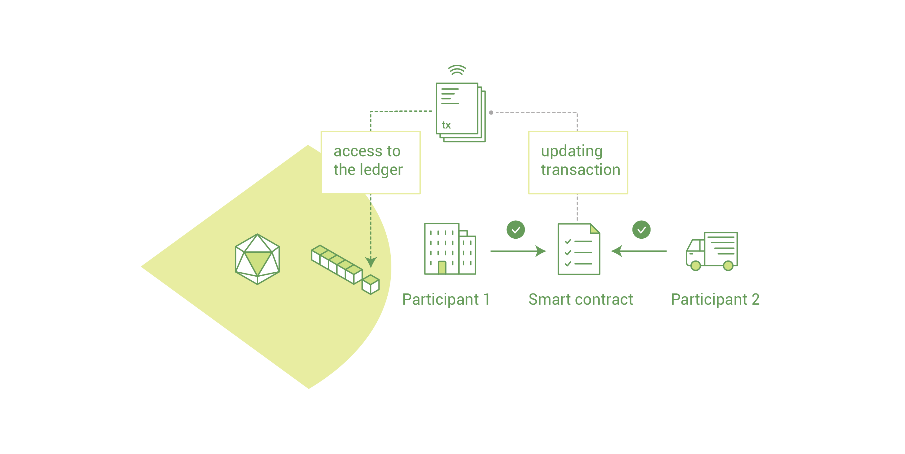
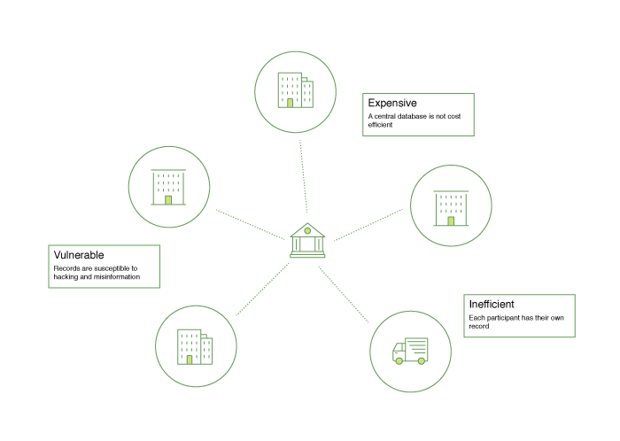

Introduction
============

Hyperledger Fabric is a platform for distributed ledger solutions
underpinned by a modular architecture delivering high degrees of
confidentiality, resiliency, flexibility and scalability. It is designed
to support pluggable implementations of different components and
accommodate the complexity and intricacies that exist across the
economic ecosystem.

Hyperledger Fabric delivers a uniquely elastic and extensible
architecture, distinguishing it from alternative blockchain solutions.
Planning for the future of enterprise blockchain requires building on
top of a fully vetted, open-source architecture; Hyperledger Fabric is
your starting point.

We recommended first-time users begin by going through the rest of the
introduction below in order to gain familiarity with how blockchains
work and with the specific features and components of Hyperledger
Fabric.

Once comfortable \-- or if you\'re already familiar with blockchain and
Hyperledger Fabric \-- go to [Getting Started][1] and from
there explore the demos, technical specifications, APIs, etc.

  [1]: getting_started.md

What is a Blockchain?
---------------------

**A Distributed Ledger**

At the heart of a blockchain network is a distributed ledger that
records all the transactions that take place on the network.

A blockchain ledger is often described as **decentralized** because it
is replicated across many network participants, each of whom
**collaborate** in its maintenance. We'll see that decentralization and
collaboration are powerful attributes that mirror the way businesses
exchange goods and services in the real world.

In addition to being decentralized and collaborative, the information
recorded to a blockchain is append-only, using cryptographic techniques
that guarantee that once a transaction has been added to the ledger it
cannot be modified. This property of immutability makes it simple to
determine the provenance of information because participants can be sure
information has not been changed after the fact. It's why blockchains
are sometimes described as **systems of proof**.

 \**Smart Contracts*\*

To support the consistent update of information -- and to enable a whole
host of ledger functions (transacting, querying, etc) -- a blockchain
network uses **smart contracts** to provide controlled access to the
ledger.

Smart contracts are not only a key mechanism for encapsulating
information and keeping it simple across the network, they can also be
written to allow participants to execute certain aspects of transactions
automatically.

A smart contract can, for example, be written to stipulate the cost of
shipping an item that changes depending on when it arrives. With the
terms agreed to by both parties and written to the ledger, the
appropriate funds change hands automatically when the item is received.

**Consensus**

The process of keeping the ledger transactions synchronized across the
network -- to ensure that ledgers only update when transactions are
approved by the appropriate participants, and that when ledgers do
update, they update with the same transactions in the same order -- is
called **consensus**.

We'll learn a lot more about ledgers, smart contracts and consensus
later. For now, it's enough to think of a blockchain as a shared,
replicated transaction system which is updated via smart contracts and
kept consistently synchronized through a collaborative process called
consensus.

Why is a Blockchain useful?
---------------------------

**Today's Systems of Record**

The transactional networks of today are little more than slightly
updated versions of networks that have existed since business records
have been kept. The members of a **Business Network** transact with each
other, but they maintain separate records of their transactions. And the
things they're transacting -- whether it's Flemish tapestries in the
16th century or the securities of today -- must have their provenance
established each time they're sold to ensure that the business selling
an item possesses a chain of title verifying their ownership of it.

What you're left with is a business network that looks like this:

Modern technology has taken this process from stone tablets and paper
folders to hard drives and cloud platforms, but the underlying structure
is the same. Unified systems for managing the identity of network
participants do not exist, establishing provenance is so laborious it
takes days to clear securities transactions (the world volume of which
is numbered in the many trillions of dollars), contracts must be signed
and executed manually, and every database in the system contains unique
information and therefore represents a single point of failure.

It's impossible with today's fractured approach to information and
process sharing to build a system of record that spans a business
network, even though the needs of visibility and trust are clear.

**The Blockchain Difference**

What if instead of the rat's nest of inefficiencies represented by the
"modern" system of transactions, business networks had standard methods
for establishing identity on the network, executing transactions, and
storing data? What if establishing the provenance of an asset could be
determined by looking through a list of transactions that, once written,
cannot be changed, and can therefore be trusted?

That business network would look more like this:

This is a blockchain network. Every participant in it has their own
replicated copy of the ledger. In addition to ledger information being
shared, the processes which update the ledger are also shared. Unlike
today's systems, where a participant's **private** programs are used to
update their **private** ledgers, a blockchain system has **shared**
programs to update **shared** ledgers.

With the ability to coordinate their business network through a shared
ledger, blockchain networks can reduce the time, cost, and risk
associated with private information and processing while improving trust
and visibility.

You now know what blockchain is and why it's useful. There are a lot of
other details that are important, but they all relate to these
fundamental ideas of the sharing of information and processes.

What is Hyperledger Fabric?
---------------------------

The Linux Foundation founded Hyperledger in 2015 to advance
cross-industry blockchain technologies. Rather than declaring a single
blockchain standard, it encourages a collaborative approach to
developing blockchain technologies via a community process, with
intellectual property rights that encourage open development and the
adoption of key standards over time.

Hyperledger Fabric is one of the blockchain projects within Hyperledger.
Like other blockchain technologies, it has a ledger, uses smart
contracts, and is a system by which participants manage their
transactions.

Where Hyperledger Fabric breaks from some other blockchain systems is
that it is **private** and **permissioned**. Rather than an open
permissionless system that allows unknown identities to participate in
the network (requiring protocols like Proof of Work to validate
transactions and secure the network), the members of a Hyperledger
Fabric network enroll through a **Membership Service Provider (MSP)**.

Hyperledger Fabric also offers several pluggable options. Ledger data
can be stored in multiple formats, consensus mechanisms can be switched
in and out, and different MSPs are supported.

Hyperledger Fabric also offers the ability to create **channels**,
allowing a group of participants to create a separate ledger of
transactions. This is an especially important option for networks where
some participants might be competitors and not want every transaction
they make - a special price they\'re offering to some participants and
not others, for example - known to every participant. If two
participants form a channel, then those participants -- and no others --
have copies of the ledger for that channel.

**Shared Ledger**

Hyperledger Fabric has a ledger subsystem comprising two components: the
**world state** and the **transaction log**. Each participant has a copy
of the ledger to every Hyperledger Fabric network they belong to.

The world state component describes the state of the ledger at a given
point in time. It's the database of the ledger. The transaction log
component records all transactions which have resulted in the current
value of the world state. It's the update history for the world state.
The ledger, then, is a combination of the world state database and the
transaction log history.

The ledger has a replaceable data store for the world state. By default,
this is a LevelDB key-value store database. The transaction log does not
need to be pluggable. It simply records the before and after values of
the ledger database being used by the blockchain network.

**Smart Contracts**

Hyperledger Fabric smart contracts are written in **chaincode** and are
invoked by an application external to the blockchain when that
application needs to interact with the ledger. In most cases chaincode
only interacts with the database component of the ledger, the world
state (querying it, for example), and not the transaction log.

Chaincode can be implemented in several programming languages. The
currently supported chaincode language is [Go](https://golang.org/) with
support for Java and other languages coming in future releases.

**Privacy**

Depending on the needs of a network, participants in a
Business-to-Business (B2B) network might be extremely sensitive about
how much information they share. For other networks, privacy will not be
a top concern.

Hyperledger Fabric supports networks where privacy (using channels) is a
key operational requirement as well as networks that are comparatively
open.

**Consensus**

Transactions must be written to the ledger in the order in which they
occur, even though they might be between different sets of participants
within the network. For this to happen, the order of transactions must
be established and a method for rejecting bad transactions that have
been inserted into the ledger in error (or maliciously) must be put into
place.

This is a thoroughly researched area of computer science, and there are
many ways to achieve it, each with different trade-offs. For example,
PBFT (Practical Byzantine Fault Tolerance) can provide a mechanism for
file replicas to communicate with each other to keep each copy
consistent, even in the event of corruption. Alternatively, in Bitcoin,
ordering happens through a process called mining where competing
computers race to solve a cryptographic puzzle which defines the order
that all processes subsequently build upon.

Hyperledger Fabric has been designed to allow network starters to choose
a consensus mechanism that best represents the relationships that exist
between participants. As with privacy, there is a spectrum of needs;
from networks that are highly structured in their relationships to those
that are more peer-to-peer.

We'll learn more about the Hyperledger Fabric consensus mechanisms,
which currently include SOLO, Kafka, and will soon extend to SBFT
(Simplified Byzantine Fault Tolerance), in another document.

Where can I learn more?
-----------------------

We provide a number of [tutorials][1] and [samples][2] where you'll be introduced to most of
the key components within a blockchain network, learn more about how
they interact with each other, and then you'll actually get the code and
run some simple transactions against a running blockchain network. We
also provide tutorials for those of you thinking of operating a
blockchain network using Hyperledger Fabric.

  [2]: samples.md

A [deeper look][3] at the components and concepts brought up in this
introduction as well as a few others and describes how they work
together in a sample transaction flow.

  [3]: fabric_model.md
  
