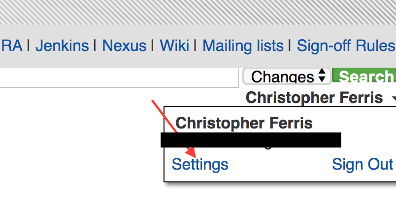
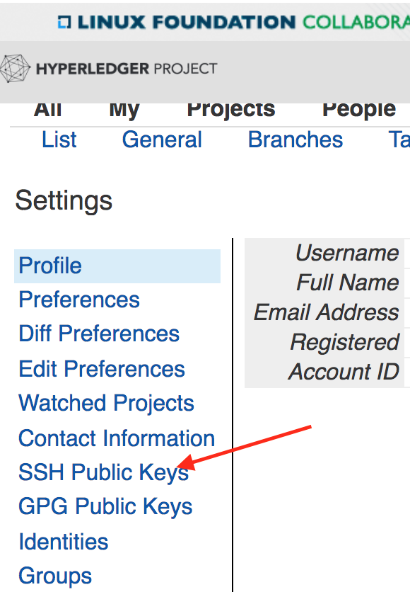
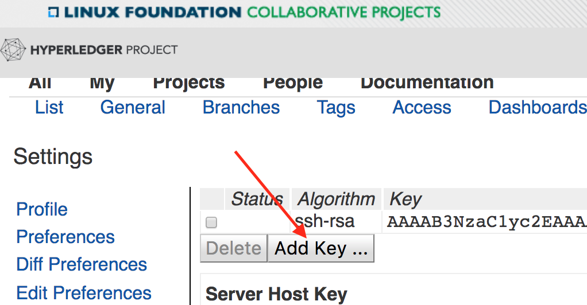
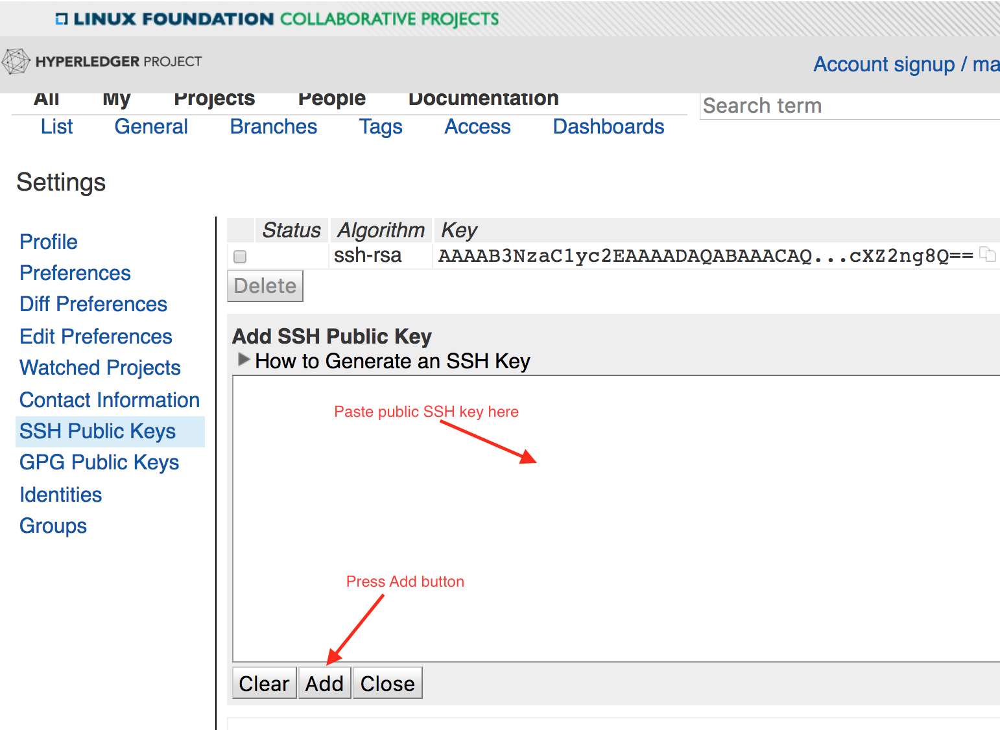
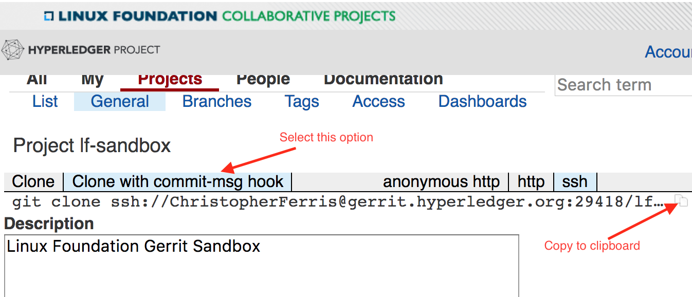

Submitting your first change request (CR)
=========================================

We are using
[Gerrit](https://gerrit.hyperledger.org/r/#/admin/projects/fabric) to
manage code contributions and reviews. If you are unfamiliar with
Gerrit, please review this [document \<Gerrit/gerrit\>]{role="doc"}
before proceeding.

::: {.note}
::: {.admonition-title}
Note
:::

Gerrit has a reputation of having a clunky user experience. However,

:   the Google team has been working on improving this, and they have
    added a \"New UI\" option that will allow you to work with their new
    and much improved UX. See the link at the bottom of the Fabric
    Gerrit page, linked above.


:::

Setting up your SSH key
-----------------------

Before you can submit a change set for review, you will need to register
your public SSH key. Login to [Gerrit](https://gerrit.hyperledger.org)
with your [LFID \<Gerrit/lf-account\>]{role="doc"}, and click on your
name in the upper right-hand corner of your browser window and then
click \'Settings\'.

{width="300px"}

In the left-hand margin, you should see a link for \'SSH Public Keys\'.

{width="200px"}

Press the `Add Key...` button

{width="400px"}

Copy-n-paste your [public SSH
key](https://help.github.com/articles/generating-an-ssh-key/) into the
window and press \'Add\'.

{width="600px"}

Sandbox
-------

We have created the [lf-sandbox
project](https://gerrit.hyperledger.org/r/#/admin/projects/lf-sandbox,branches),
to allow you to familiarize yourself with using Gerrit. We\'ll use that
project in our tutorial for submitting your first CR.

Clone your project
------------------

First step is to clone your project to your laptop or development
server. Navigate your browser to the Gerrit
[Projects](https://gerrit.hyperledger.org/r/#/admin/projects/) page and
scroll down to the `lf-sandbox` project.

{width="500px"}

The project page will provide you with the full git clone command needed
to clone the project. Select the `clone with commit-msg hook` option and
copy the command to the clipboard.

{width="600px"}

Now, in a terminal window on your laptop, paste and run the command.
e.g.

``` {.sourceCode .}
git clone ssh://foobar@gerrit.hyperledger.org:29418/lf-sandbox && scp -p -P 29418 foobar@gerrit.hyperledger.org:hooks/commit-msg lf-sandbox/.git/hooks/
```

Checkout a development branch
-----------------------------

Now that you have cloned the repository, change directory to the
`lf-sandbox` directory. Now let\'s make a change. First, let\'s create a
new branch in which to work:

``` {.sourceCode .}
git checkout -b <newbranchname>
```

Now let\'s modify a file. Pick a file, any file and make a change. You
can also add a new file or delete an existing file. Don\'t be shy, this
is just a sandbox.

Committing your change
----------------------

Once you\'ve made your change, check to see what the current status is.

``` {.sourceCode .}
git status
On branch foo
Untracked files:
 (use "git add <file>..." to include in what will be committed)

  README.md

nothing added to commit but untracked files present (use "git add" to track)
```

Now let\'s add the changed file to the list of files tracked by git.

``` {.sourceCode .}
git add .
```

Now let\'s commit that change.

``` {.sourceCode .}
git commit -s
```

This will open up an editing session using your favorite command-line
editor where you will fill in a commit message. Add a commit message.

::: {.note}
::: {.admonition-title}
Note
:::

Note that for the Hyperledger Fabric project(s) we would have a

:   title line that includes the JIRA number of the issue to which the
    change request applies. Please review the
    [guidelines \<Gerrit/changes\>]{role="doc"} for change requests.
:::

``` {.sourceCode .}
FAB-1234

I made a change

Signed-off-by: John Doe <cjohn.doe@example.com>

# Please enter the commit message for your changes. Lines starting
# with '#' will be ignored, and an empty message aborts the commit.
# On branch foo
# Changes to be committed:
#       new file:   README.md
#
```

Submitting your change request
------------------------------

Once you have saved the commit message, you can push the change request
to Gerrit. Here, we have a couple of options.

The first option is to use the full git syntax.

``` {.sourceCode .}
git push origin HEAD:refs/for/master
```

This will yield results something like the following:

``` {.sourceCode .}
Counting objects: 3, done.
Delta compression using up to 4 threads.
Compressing objects: 100% (2/2), done.
Writing objects: 100% (3/3), 340 bytes | 0 bytes/s, done.
Total 3 (delta 1), reused 0 (delta 0)
remote: Resolving deltas: 100% (1/1)
remote: Processing changes: new: 1, refs: 1, done
remote: Missing issue-id in commit message
remote: Commit 539d9a1fe036f332db87d37b49cea705bdf6e432 not associated to any issue
remote:
remote: Hint: insert one or more issue-id anywhere in the commit message.
remote:       Issue-ids are strings matching ([A-Z][A-Z0-9]{1,9}-\d+)
remote:       and are pointing to existing tickets on its-jira Issue-Tracker
remote:
remote: New Changes:
remote:   https://gerrit.hyperledger.org/r/16157 I made a change
remote:
To ssh://gerrit.hyperledger.org:29418/lf-sandbox
 * [new branch]      HEAD -> refs/for/master
```

The second option, [git
review](https://www.mediawiki.org/wiki/Gerrit/git-review) simplifies
things a bit. The link above will provide info on how to install and
setup `git-review`.

Once installed and configured, you can submit your change with
`git review`.

    $ git review

Modifying your change request
-----------------------------

If you need to update your patch, say to address a review comment, or to
fix something affecting CI, you can commit revised changes with

``` {.sourceCode .}
git commit --amend
```

and then repeat the `git review` or full syntax as before.

Should you have further questions, please don\'t hesitate to ask on the
mailing list or rocket chat.
