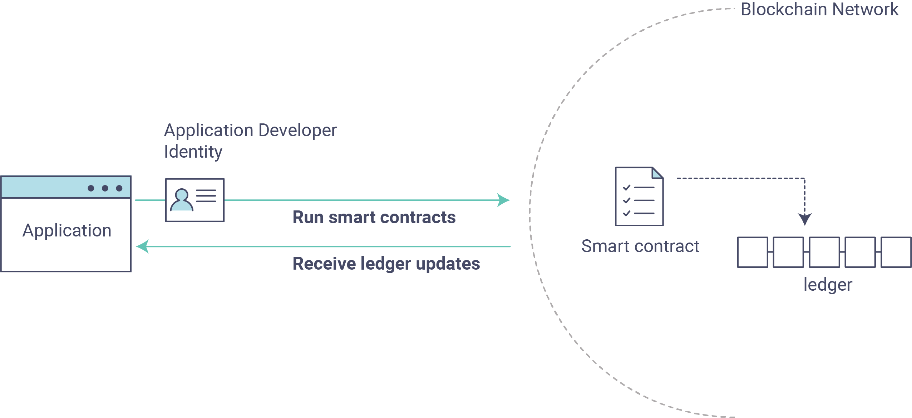
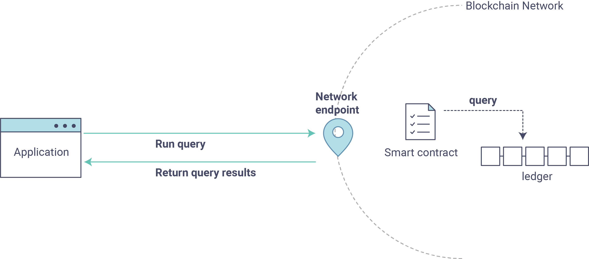
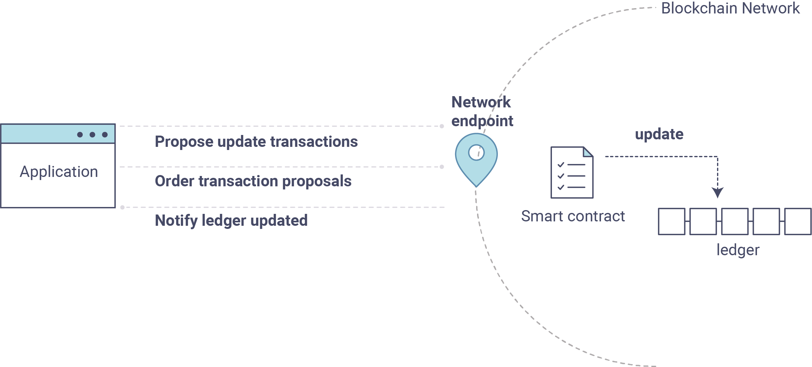

Writing Your First Application
==============================

::: {.note}
::: {.admonition-title}
Note
:::

If you\'re not yet familiar with the fundamental architecture of a

:   Fabric network, you may want to visit the [blockchain]{role="doc"}
    and [build\_network]{role="doc"} documentation prior to continuing.
:::

In this section we\'ll be looking at a handful of sample programs to see
how Fabric apps work. These apps (and the smart contract they use) \--
collectively known as `fabcar` \-- provide a broad demonstration of
Fabric functionality. Notably, we will show the process for interacting
with a Certificate Authority and generating enrollment certificates,
after which we will leverage these generated identities (user objects)
to query and update a ledger.

We'll go through three principle steps:

> **1. Setting up a development environment.** Our application needs a
> network to interact with, so we\'ll download one stripped down to just
> the components we need for registration/enrollment, queries and
> updates:
>
> 
>
> **2. Learning the parameters of the sample smart contract our app will
> use.** Our smart contract contains various functions that allow us to
> interact with the ledger in different ways. We'll go in and inspect
> that smart contract to learn about the functions our applications will
> be using.
>
> **3. Developing the applications to be able to query and update assets
> on the ledger.** We\'ll get into the app code itself (our apps have
> been written in Javascript) and manually manipulate the variables to
> run different kinds of queries and updates.

After completing this tutorial you should have a basic understanding of
how an application is programmed in conjunction with a smart contract to
interact with the ledger (i.e. the peer) on a Fabric network.

Setting up your Dev Environment
-------------------------------

First thing, let\'s download the Fabric images and the accompanying
artifacts for the network and applications\...

Visit the [prereqs]{role="doc"} page and ensure you have the necessary
dependencies installed on your machine.

Next, visit the [samples]{role="doc"} page and follow the provided
instructions. Return to this tutorial once you have cloned the
`fabric-samples` repository, and downloaded the latest stable Fabric
images and available utilities.

At this point everything should be installed. Navigate to the `fabcar`
subdirectory within your `fabric-samples` repository and take a look at
what\'s inside:

``` {.sourceCode .bash}
cd fabric-samples/fabcar  && ls
```

You should see the following:

``` {.sourceCode .bash}
enrollAdmin.js invoke.js   package.json    query.js    registerUser.js startFabric.sh
```

Before starting we also need to do a little housekeeping. Run the
following command to kill any stale or active containers:

``` {.sourceCode .bash}
docker rm -f $(docker ps -aq)
```

Clear any cached networks:

``` {.sourceCode .bash}
# Press 'y' when prompted by the command

docker network prune
```

And lastly if you\'ve already run through this tutorial, you\'ll also
want to delete the underlying chaincode image for the `fabcar` smart
contract. If you\'re a user going through this content for the first
time, then you won\'t have this chaincode image on your system:

``` {.sourceCode .bash}
docker rmi dev-peer0.org1.example.com-fabcar-1.0-5c906e402ed29f20260ae42283216aa75549c571e2e380f3615826365d8269ba
```

### Install the clients & launch the network

::: {.note}
::: {.admonition-title}
Note
:::

The following instructions require you to be in the `fabcar` subdirectory

:   within your local clone of the `fabric-samples` repo. Remain at the
    root of this subdirectory for the remainder of this tutorial.
:::

Run the following command to install the Fabric dependencies for the
applications. We are concerned with `fabric-ca-client` which will allow
our app(s) to communicate with the CA server and retrieve identity
material, and with `fabric-client` which allows us to load the identity
material and talk to the peers and ordering service.

``` {.sourceCode .bash}
npm install
```

Launch your network using the `startFabric.sh` shell script. This
command will spin up our various Fabric entities and launch a smart
contract container for chaincode written in Golang:

``` {.sourceCode .bash}
./startFabric.sh
```

You also have the option of running this tutorial against chaincode
written in Node.js. If you\'d like to pursue this route, issue the
following command instead:

``` {.sourceCode .bash}
./startFabric.sh node
```

::: {.note}
::: {.admonition-title}
Note
:::

Be aware that the Node.js chaincode scenario will take roughly 90 seconds

:   to complete; perhaps longer. The script is not hanging, rather the
    increased time is a result of the fabric-shim being installed as the
    chaincode image is being built.
:::

Alright, now that you've got a sample network and some code, let's take
a look at how the different pieces fit together.

How Applications Interact with the Network
------------------------------------------

For a more in-depth look at the components in our `fabcar` network (and
how they\'re deployed) as well as how applications interact with those
components on more of a granular level, see
[understand\_fabcar\_network]{role="doc"}.

Developers more interested in seeing what applications **do** \-- as
well as looking at the code itself to see how an application is
constructed \-- should continue. For now, the most important thing to
know is that applications use a software development kit (SDK) to access
the **APIs** that permit queries and updates to the ledger.

Enrolling the Admin User
------------------------

::: {.note}
::: {.admonition-title}
Note
:::

The following two sections involve communication with the Certificate

:   Authority. You may find it useful to stream the CA logs when running
    the upcoming programs.
:::

To stream your CA logs, split your terminal or open a new shell and
issue the following:

``` {.sourceCode .bash}
docker logs -f ca.example.com
```

Now hop back to your terminal with the `fabcar` content\...

When we launched our network, an admin user - `admin` - was registered
with our Certificate Authority. Now we need to send an enroll call to
the CA server and retrieve the enrollment certificate (eCert) for this
user. We won\'t delve into enrollment details here, but suffice it to
say that the SDK and by extension our applications need this cert in
order to form a user object for the admin. We will then use this admin
object to subsequently register and enroll a new user. Send the admin
enroll call to the CA server:

``` {.sourceCode .bash}
node enrollAdmin.js
```

This program will invoke a certificate signing request (CSR) and
ultimately output an eCert and key material into a newly created folder
- `hfc-key-store` - at the root of this project. Our apps will then look
to this location when they need to create or load the identity objects
for our various users.

Register and Enroll `user1`
---------------------------

With our newly generated admin eCert, we will now communicate with the
CA server once more to register and enroll a new user. This user -
`user1` - will be the identity we use when querying and updating the
ledger. It\'s important to note here that it is the `admin` identity
that is issuing the registration and enrollment calls for our new user
(i.e. this user is acting in the role of a registrar). Send the register
and enroll calls for `user1`:

``` {.sourceCode .bash}
node registerUser.js
```

Similar to the admin enrollment, this program invokes a CSR and outputs
the keys and eCert into the `hfc-key-store` subdirectory. So now we have
identity material for two separate users - `admin` & `user1`. Time to
interact with the ledger\...

Querying the Ledger
-------------------

Queries are how you read data from the ledger. This data is stored as a
series of key/value pairs, and you can query for the value of a single
key, multiple keys, or \-- if the ledger is written in a rich data
storage format like JSON \--perform complex searches against it (looking
for all assets that contain certain keywords, for example).

This is a representation of how a query works:



First, let\'s run our `query.js` program to return a listing of all the
cars on the ledger. We will use our second identity - `user1` - as the
signing entity for this application. The following line in our program
specifies `user1` as the signer:

``` {.sourceCode .bash}
fabric_client.getUserContext('user1', true);
```

Recall that the `user1` enrollment material has already been placed into
our `hfc-key-store` subdirectory, so we simply need to tell our
application to grab that identity. With the user object defined, we can
now proceed with reading from the ledger. A function that will query all
the cars, `queryAllCars`, is pre-loaded in the app, so we can simply run
the program as is:

``` {.sourceCode .bash}
node query.js
```

It should return something like this:

``` {.sourceCode .json}
Successfully loaded user1 from persistence
Query has completed, checking results
Response is  [{"Key":"CAR0", "Record":{"colour":"blue","make":"Toyota","model":"Prius","owner":"Tomoko"}},
{"Key":"CAR1",   "Record":{"colour":"red","make":"Ford","model":"Mustang","owner":"Brad"}},
{"Key":"CAR2", "Record":{"colour":"green","make":"Hyundai","model":"Tucson","owner":"Jin Soo"}},
{"Key":"CAR3", "Record":{"colour":"yellow","make":"Volkswagen","model":"Passat","owner":"Max"}},
{"Key":"CAR4", "Record":{"colour":"black","make":"Tesla","model":"S","owner":"Adriana"}},
{"Key":"CAR5", "Record":{"colour":"purple","make":"Peugeot","model":"205","owner":"Michel"}},
{"Key":"CAR6", "Record":{"colour":"white","make":"Chery","model":"S22L","owner":"Aarav"}},
{"Key":"CAR7", "Record":{"colour":"violet","make":"Fiat","model":"Punto","owner":"Pari"}},
{"Key":"CAR8", "Record":{"colour":"indigo","make":"Tata","model":"Nano","owner":"Valeria"}},
{"Key":"CAR9", "Record":{"colour":"brown","make":"Holden","model":"Barina","owner":"Shotaro"}}]
```

These are the 10 cars. A black Tesla Model S owned by Adriana, a red
Ford Mustang owned by Brad, a violet Fiat Punto owned by Pari, and so
on. The ledger is key/value based and in our implementation the key is
`CAR0` through `CAR9`. This will become particularly important in a
moment.

Let\'s take a closer look at this program. Use an editor (e.g. atom or
visual studio) and open `query.js`.

The initial section of the application defines certain variables such as
channel name, cert store location and network endpoints. In our sample
app, these variables have been baked-in, but in a real app these
variables would have to be specified by the app dev.

``` {.sourceCode .bash}
var channel = fabric_client.newChannel('mychannel');
var peer = fabric_client.newPeer('grpc://localhost:7051');
channel.addPeer(peer);

var member_user = null;
var store_path = path.join(__dirname, 'hfc-key-store');
console.log('Store path:'+store_path);
var tx_id = null;
```

This is the chunk where we construct our query:

``` {.sourceCode .bash}
// queryCar chaincode function - requires 1 argument, ex: args: ['CAR4'],
// queryAllCars chaincode function - requires no arguments , ex: args: [''],
const request = {
  //targets : --- letting this default to the peers assigned to the channel
  chaincodeId: 'fabcar',
  fcn: 'queryAllCars',
  args: ['']
};
```

When the application ran, it invoked the `fabcar` chaincode on the peer,
ran the `queryAllCars` function within it, and passed no arguments to
it.

To take a look at the available functions within our smart contract,
navigate to the `chaincode/fabcar/go` subdirectory at the root of
`fabric-samples` and open `fabcar.go` in your editor.

::: {.note}
::: {.admonition-title}
Note
:::

These same functions are defined within the Node.js version of the

:   `fabcar` chaincode.
:::

You\'ll see that we have the following functions available to call:
`initLedger`, `queryCar`, `queryAllCars`, `createCar`, and
`changeCarOwner`.

Let\'s take a closer look at the `queryAllCars` function to see how it
interacts with the ledger.

``` {.sourceCode .bash}
func (s *SmartContract) queryAllCars(APIstub shim.ChaincodeStubInterface) sc.Response {

  startKey := "CAR0"
  endKey := "CAR999"

  resultsIterator, err := APIstub.GetStateByRange(startKey, endKey)
```

This defines the range of `queryAllCars`. Every car between `CAR0` and
`CAR999` \-- 1,000 cars in all, assuming every key has been tagged
properly \-- will be returned by the query.

Below is a representation of how an app would call different functions
in chaincode. Each function must be coded against an available API in
the chaincode shim interface, which in turn allows the smart contract
container to properly interface with the peer ledger.


We can see our `queryAllCars` function, as well as one called
`createCar`, that will allow us to update the ledger and ultimately
append a new block to the chain in a moment.

But first, go back to the `query.js` program and edit the constructor
request to query `CAR4`. We do this by changing the function in
`query.js` from `queryAllCars` to `queryCar` and passing `CAR4` as the
specific key.

The `query.js` program should now look like this:

``` {.sourceCode .bash}
const request = {
  //targets : --- letting this default to the peers assigned to the channel
  chaincodeId: 'fabcar',
  fcn: 'queryCar',
  args: ['CAR4']
};
```

Save the program and navigate back to your `fabcar` directory. Now run
the program again:

``` {.sourceCode .bash}
node query.js
```

You should see the following:

``` {.sourceCode .json}
{"colour":"black","make":"Tesla","model":"S","owner":"Adriana"}
```

If you go back and look at the result from when we queried every car
before, you can see that `CAR4` was Adriana's black Tesla model S, which
is the result that was returned here.

Using the `queryCar` function, we can query against any key (e.g.
`CAR0`) and get whatever make, model, color, and owner correspond to
that car.

Great. At this point you should be comfortable with the basic query
functions in the smart contract and the handful of parameters in the
query program. Time to update the ledger\...

Updating the Ledger
-------------------

Now that we've done a few ledger queries and added a bit of code, we're
ready to update the ledger. There are a lot of potential updates we
could make, but let\'s start by creating a car.

Below we can see how this process works. An update is proposed,
endorsed, then returned to the application, which in turn sends it to be
ordered and written to every peer\'s ledger:



Our first update to the ledger will be to create a new car. We have a
separate Javascript program \-- `invoke.js` \-- that we will use to make
updates. Just as with queries, use an editor to open the program and
navigate to the code block where we construct our invocation:

``` {.sourceCode .bash}
// createCar chaincode function - requires 5 args, ex: args: ['CAR12', 'Honda', 'Accord', 'Black', 'Tom'],
// changeCarOwner chaincode function - requires 2 args , ex: args: ['CAR10', 'Barry'],
// must send the proposal to endorsing peers
var request = {
  //targets: let default to the peer assigned to the client
  chaincodeId: 'fabcar',
  fcn: '',
  args: [''],
  chainId: 'mychannel',
  txId: tx_id
};
```

You\'ll see that we can call one of two functions - `createCar` or
`changeCarOwner`. First, let's create a red Chevy Volt and give it to an
owner named Nick. We\'re up to `CAR9` on our ledger, so we\'ll use
`CAR10` as the identifying key here. Edit this code block to look like
this:

``` {.sourceCode .bash}
var request = {
  //targets: let default to the peer assigned to the client
  chaincodeId: 'fabcar',
  fcn: 'createCar',
  args: ['CAR10', 'Chevy', 'Volt', 'Red', 'Nick'],
  chainId: 'mychannel',
  txId: tx_id
};
```

Save it and run the program:

``` {.sourceCode .bash}
node invoke.js
```

There will be some output in the terminal about `ProposalResponse` and
promises. However, all we\'re concerned with is this message:

``` {.sourceCode .bash}
The transaction has been committed on peer localhost:7053
```

To see that this transaction has been written, go back to `query.js` and
change the argument from `CAR4` to `CAR10`.

In other words, change this:

``` {.sourceCode .bash}
const request = {
  //targets : --- letting this default to the peers assigned to the channel
  chaincodeId: 'fabcar',
  fcn: 'queryCar',
  args: ['CAR4']
};
```

To this:

``` {.sourceCode .bash}
const request = {
  //targets : --- letting this default to the peers assigned to the channel
  chaincodeId: 'fabcar',
  fcn: 'queryCar',
  args: ['CAR10']
};
```

Save once again, then query:

``` {.sourceCode .bash}
node query.js
```

Which should return this:

``` {.sourceCode .bash}
Response is  {"colour":"Red","make":"Chevy","model":"Volt","owner":"Nick"}
```

Congratulations. You've created a car!

So now that we've done that, let's say that Nick is feeling generous and
he wants to give his Chevy Volt to someone named Dave.

To do this go back to `invoke.js` and change the function from
`createCar` to `changeCarOwner` and input the arguments like this:

``` {.sourceCode .bash}
var request = {
  //targets: let default to the peer assigned to the client
  chaincodeId: 'fabcar',
  fcn: 'changeCarOwner',
  args: ['CAR10', 'Dave'],
  chainId: 'mychannel',
  txId: tx_id
};
```

The first argument \-- `CAR10` \-- reflects the car that will be
changing owners. The second argument \-- `Dave` \-- defines the new
owner of the car.

Save and execute the program again:

``` {.sourceCode .bash}
node invoke.js
```

Now let's query the ledger again and ensure that Dave is now associated
with the `CAR10` key:

``` {.sourceCode .bash}
node query.js
```

It should return this result:

``` {.sourceCode .bash}
Response is  {"colour":"Red","make":"Chevy","model":"Volt","owner":"Dave"}
```

The ownership of `CAR10` has been changed from Nick to Dave.

::: {.note}
::: {.admonition-title}
Note
:::

In a real world application the chaincode would likely have some access

:   control logic. For example, only certain authorized users may create
    new cars, and only the car owner may transfer the car to somebody
    else.
:::

Summary
-------

Now that we've done a few queries and a few updates, you should have a
pretty good sense of how applications interact with the network. You've
seen the basics of the roles smart contracts, APIs, and the SDK play in
queries and updates and you should have a feel for how different kinds
of applications could be used to perform other business tasks and
operations.

In subsequent documents we'll learn how to actually **write** a smart
contract and how some of these more low level application functions can
be leveraged (especially relating to identity and membership services).

Additional Resources
--------------------

The [Hyperledger Fabric Node SDK
repo](https://github.com/hyperledger/fabric-sdk-node) is an excellent
resource for deeper documentation and sample code. You can also consult
the Fabric community and component experts on [Hyperledger Rocket
Chat](https://chat.hyperledger.org/home).

<a rel="license" href="http://creativecommons.org/licenses/by/4.0/"></a><br />This work is licensed under a <a rel="license" href="http://creativecommons.org/licenses/by/4.0/">Creative Commons Attribution 4.0 International License</a>
